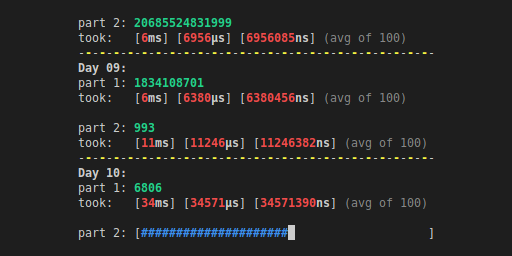

# AoC 2023 with Java

## Build

### Requirements

Tech | Version
----- | --------
Maven | 3.6.3
JDK | 20.0.2

> [!NOTE]
> You might be able to get away with changing the build files as you prefer, these are just what I'm using.

### Compile and Run

after cd to adventOfJava folder:

```bash
mvn install
mvn exec:java  -Dexec.mainClass=com.aoc.AdventOfCode -Dexec.args="0 0 1"
```
Change args depending on which answer you wish to see, or no args if you wish to play all days:

```bash
-Dexec.args="<day(0-25)> <part(0/1/2) <rounds>"
```

> [!TIP]
> You can specify -1 days to play through all of the days and parts. Rounds specifies how many times each puzzle will be played for benchmarking.

> 
>
> *Example run displaing average times it takes to complete each day and part*


